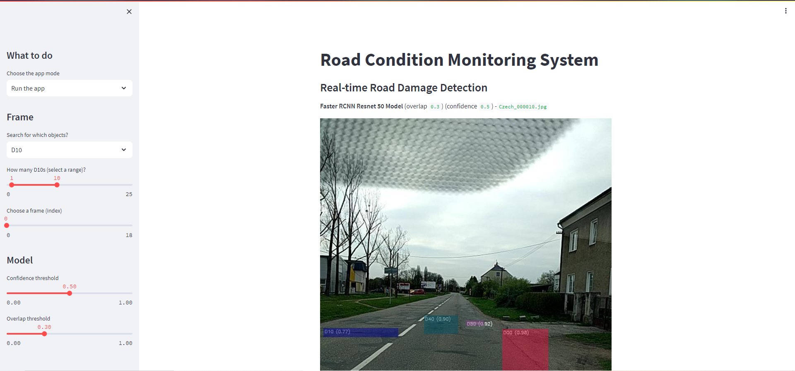

# Real-Time Road Damage Detection



## Table of Contents

- [Introduction](#introduction)
- [Project Overview](#project-overview)
- [Dependencies](#dependencies)
- [Installation](#installation)
- [Usage](#usage)
  - [Running the App](#running-the-app)
  - [Uploading an Image](#uploading-an-image)
  - [Adjusting Detection Parameters](#adjusting-detection-parameters)
- [Implementation Details](#implementation-details)
  - [Data and Datasets](#data-and-datasets)
  - [Model and Detection](#model-and-detection)
- [Troubleshooting](#troubleshooting)
- [Contributing](#contributing)
- [License](#license)

## Introduction

The Real-Time Road Damage Detection project is a Python application that aims to identify and visualize various types of road damage in images. It utilizes deep learning models for object detection and provides real-time feedback on road damage instances in uploaded images.

## Project Overview

The project encompasses the following key functionalities:

- Real-time detection of road damage in uploaded images.
- Visualization of detected road damage using bounding boxes and labels.
- Customizable detection parameters (confidence threshold, overlap threshold).
- Summary and metadata information about the detected damage.
- Beep sound notification on identifying a detection.
- The ability to check your own road damage images.

## Dependencies

The project relies on various Python libraries and packages. Some of the core dependencies include:

- [PyTorch](https://pytorch.org/)
- [Detectron2](https://github.com/facebookresearch/detectron2)
- [Streamlit](https://streamlit.io/)
- [Pandas](https://pandas.pydata.org/)
- [NumPy](https://numpy.org/)

Make sure to have these dependencies installed before running the application. It's advisable to use a virtual environment to manage dependencies.

## Installation

Before you can run the application, you need to set up the necessary configurations. Here's a step-by-step guide:

1. Install the required dependencies. You can use the following commands to install some of them:
   ```bash
   pip install torch torchvision
   pip install detectron2
   pip install streamlit pandas numpy

2. Run the Streamlit application. To launch the application, run the app.py script using Streamlit:
    ```bash
    streamlit run app.py

## Usage
### Running the App
Once you have set up the application, you can use it to perform real-time road damage detection:

### Start the application using Streamlit.

### Select "Run the app" from the sidebar.

The application will guide you through the process of uploading images and configuring detection parameters.

## Uploading an Image
### To detect road damage in an image:

Click on the "Check your own file" option.

Use the file uploader to select an image of a damaged road.

The application will display the uploaded image, and you can adjust the detection parameters.

### Adjusting Detection Parameters
You can customize detection parameters to fine-tune the results:

- Confidence Threshold: This sets the minimum confidence level for detected damage. Increase it to reduce false positives.

- Overlap Threshold: Adjust this to control how overlapping detections are handled.

### Implementation Details
#### Data and Datasets
The application uses datasets containing images of road damage. The code references specific directories and paths for dataset images and annotations. Ensure that your data is structured correctly and that the code can access it.

#### Model and Detection
The project employs deep learning models, specifically the Faster R-CNN with ResNet-50, for road damage detection. The trained model is loaded using Detectron2. Detected objects are drawn as bounding boxes on the images, and relevant labels are displayed. The detection parameters, such as confidence and overlap thresholds, can be adjusted to refine the results.

## Troubleshooting
If you encounter any issues or have questions about the  project, please refer to the documentation or seek help from the project contributors.

## Contributing
Contributions to this project are welcome! If you'd like to contribute or report issues, please refer to the project's GitHub repository.


